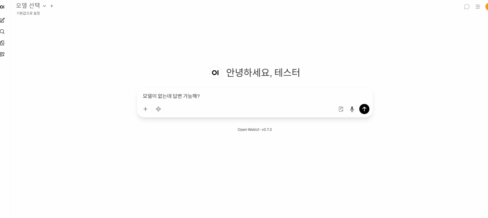

```
docker run -d -p 3000:8080 `
  -v ollama:/root/.ollama `
  -v open-webui:/app/backend/data `
  --name open-webui --restart always `
  ghcr.io/open-webui/open-webui:ollama
```
## Status: Downloaded newer image for ghcr.io/open-webui/open-webui:ollama
---
```
docker exec -it open-webui ollama pull deepseek-r1
```
